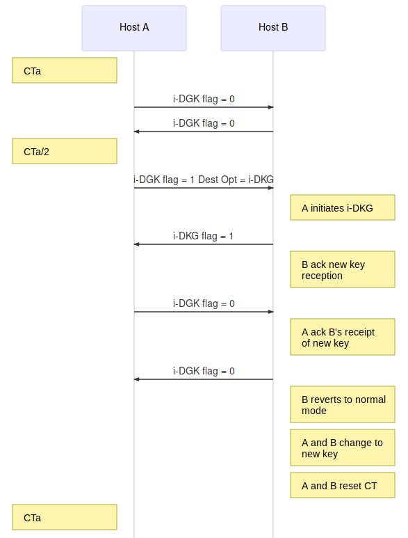

# MT6D Protocol Specification

## Keys

A symmetric key is shared between hosts (preferably out-of-band).
This key is used for address obscuration and traffic encryption.
The size of the session key is implementation dependent.
The recommended size for the session key is 512 bit.

## Dynamic Addressing

At regular time intervals, the MT6D host is computing and using it's new obscured address.

A hash of concatenated values is used to determine the next obscured host IID.

`obscuredHostIID = hashFunction(IPAddrOrig[64-127 bits] + sharedSessionKey + addrRotationTime)[0-63 bits]`

The cryptographic hash algorithm SHA-256 is used for hashing.

The MT6D IPv6 address is then formed by concatenating the host subnet with the obscured host IID.

`MT6DIPv6Address = IPAddrOrig[0-63 bits] + obscuredHostIID`

### Address Rotation

Hosts's clocks are required to be closely synchronized with a universal time server via the Network Time Protocol (NTP).
This synchronization happens during the host's initialization and then at randomized poll intervals.
Doing so helps to minimize packet loss due to clock drift.

Address rotation occurs regardless of the state of ongoing sessions.

The following equation is used to compute the address rotation time (RT) :

`RT = | UTC / ( (H(Ks) mod c1) + c2 ) |`

* UTC: Coordinated universal time
* H(Ks): Hash of the symmetric key shared between the two hosts
* c1: range of the interval
* c2: minimum rotation time

c1 and c2 are arbitrary constants set in the MT6D system parameters.

RT provides a means for hosts to know the proper rotation time without prior coordination.

After every rotation, the old address is purged from the host.

The frequency at which the address rotation time increments can be no smaller than twice the single-trip time (2\*STT) of a packet between the sender and the receiver.

## Tunneling

Source and destination address of the original packet, as well as the Ethernet frame, are removed.
A new IPv6 header is added.
It uses the obscured source/destination addresses and encapsulates the original packet in UDP.

UDP port numbers are obscured, either by mimicking normal traffic or by using unused bits of the following hash calculations:

`Src\_port = H[IID src || Ks || ti]64->79`
`Dst\_port = H[IID dst || Ks || ti]64->79`

MT6D tunneled packet representation (without Extension Header(s)):

```
0               8               16              24              32
!               !               !               !               !
+---------------------------------------------------------------+
|Version| Traffic Class |           Flow Label                  |
|---------------------------------------------------------------|
|         Payload Length        |  Next Header  |   Hop Limit   |
|---------------------------------------------------------------|
|                                                               |
|                                                               |
|                                                               |
|                    Obscured Source Address                    |
|                                                               |
|                                                               |
|                                                               |
|---------------------------------------------------------------|
|                                                               |
|                                                               |
|                                                               |
|                  Obscured Destination Address                 |
|                                                               |
|                                                               |
|                                                               |
|---------------------------------------------------------------|
|       UDP Source Port         |     UDP Destination Port      |
|---------------------------------------------------------------|
|          UDP Length           |         UDP Checksum          |
|---------------------------------------------------------------| -
|Version| Traffic Class |           Flow Label                  | |
|---------------------------------------------------------------| |
|         Payload Length        |  Next Header  |   Hop Limit   | |
|---------------------------------------------------------------| |
|                                                               | |
.                                                               . | From original packet
.                                                               . |
.                    Original Packet Payload                    . |
.                                                               . |
|                                                               | |
|                                                               | |
+---------------------------------------------------------------+ -
```

The overhead is 16 bytes per packet.

## Neighbor Discovery Protocol (NDP) Packet Handling

For Router Solicitations originating from the protected host, the MT6D device spoofs the current obscured address and forwards it.
Neighbor solicitations will be dropped at the MT6D device. The MT6D device will then generate a neighbor advertisement using its own link-layer address (DaD ignored).

When the two hosts are on the same subnet, the neighbor discovery process needs to occur after every MT6D address rotation since the destination's new address will not be in the sender's destination cache.
A host communicating with another host on the same subnet will buffer outbound packets until the neighbor discovery process is complete.

## Internet Control Message Protocol (ICMP) Packet Handling

ICMP messages generated by intermediate devices in path between two MT6D implementations require special handling.
All obscured addresses of the original ICMP packet are converted to the true addresses.
If the ICMP packet is a "Packet Too Big" message, then the advertised MTU is reduced.
To avoid ICMP "Packet Too Big", advertised MTU must be 1476 when encryption is in use, 1452 when i-DKG.

## Encryption

Encryption authenticates traffic and avoids correlation.

Packet encryption is an option which is enabled by default.

```
+-------------------------------------------------+
| MT6D   | MT6D     | Orig   | Orig     | Payload |
| IP Hdr | Ext Hdrs | IP Hdr | Ext Hdrs |         |
+-------------------------------------------------+
                     |<-------------------------->|
                        Encrypted / Unencrypted
```

The destination options header in IPv6 is used when encryption is on.
The encryption destination options header is 8 bytes long.

Encryption destination options header format:

```
0                     8                     16                    24                    32
!                     !                     !                     !                     !
+---------------------------------------------------------------------------------------+
|       Next Hdr      |   Hdr Ext Len = 0   |  Option type = 219  | Option Data Len = 1 |
|---------------------+---------------------+---------------------+---------------------|
|        Data         |   PadN Option = 1   | Option Data Len = 1 |          0          |
+---------------------------------------------------------------------------------------+
```

Data: The first 4 bits define the type of encryption used and the last 4 bits specify any required padding.
Padding is used to specify the number of bits to add to the original packet to make it a multiple of 16 bits.

AES CBC is used, blocks must be 16 bits long.

When encryption is in use, the overhead is 24 bytes (8 more bytes) due to the destination options header.

## In-Band Dynamic Key Generation (i-DKG)

Symmetric keys should be exchanged periodically.

One host initiates the key exchange (it becomes the lead) :

* A new symmetric key is generated (RNG)
* then it is encrypted with the receiver's public key.

i-DKG uses a destination options header.

The next header value of the IPv6 base packet header or the previous extension header is set to 60.

For a 128-bit symmetric key :

* Hdr Ext Len = 3, indicating an extension header length of 32 bytes
* Option type set to 204
* Opt Data Len is the number of bytes of data contained in the destination options, not including the option type or length fields (for a 128-bit key, Opt Data Len = 21)
* The first octet of data following the option data length is reserved for the key encryption type (Key Encrypt). This is the encryption algorithm used to encrypt the key prior to embedding the key into the destination options header.
* The time between key changes (CT) follows and is 4 bytes long
* The next group of bytes is the new encrypted symmetric key
* The remainder of the extension header is padded to be a multiple of 8-octets

Each host establishes a baseline key change interval in the MT6D settings.
A small random time is added to the baseline interval to minimize the likelihood of both hosts initiating i-DKG at the same time.

`CT = baseline interval + small random time`

Destination options format for i-DKG:

```
0              8              16             24             32
!              !              !              !              !
+-----------------------------------------------------------+
|   Next Hdr   | Hdr Ext Len  | Option Type  | Opt Data Len |
|--------------+--------------------------------------------|
|  Key Encrypt |                     CT                     |
|--------------+--------------------------------------------|
|  CT (cont.)  |                                            |
|---------------                                            |
|                      Key (variable length)                |
|                                                           |
|                                                           |
|              |--------------------------------------------|
|---------------      Padding (variable length)             |
|                                                           |
+-----------------------------------------------------------+
```

The host with the lower CT will be the initiator.
The initiator begins the i-DKG process after half of the key change time window (CT/2) has elapsed by notifying the other host of the impending key change.
Since both hosts may not be actively communicating, the remaining CT/2 is used as a timeout value to ensure that keys do not change without both hosts being in agreement.
After every CT/8 with no acknowledgment, the initiator sends a new symmetric key which will take effect after another CT/2 of elapsed time.
A handshaking process is used to ensure agreement before adopting new symmetric keys (one-bit flag).
i-DKG makes use of the first bit of the source port belonging to each communicating hosts.
This one-bit flag choice is arbitrary and can easily be located elsewhere.
Prior to i-DKG initialization, i-DKG flag set to 0.



```
sequenceDiagram
participant Host A
Note left of Host A: CTa
participant Host B
Host A->>Host B: i-DGK flag = 0
Host B->>Host A: i-DGK flag = 0
Note left of Host A: CTa/2
Host A->>Host B: i-DGK flag = 1 Dest Opt = i-DKG
Note right of Host B: A initiates i-DKG
Host B->>Host A: i-DKG flag = 1
Note right of Host B: B ack new key<br/>reception
Host A->>Host B: i-DGK flag = 0
Note right of Host B: A ack B's receipt<br/>of new key
Host B->>Host A: i-DGK flag = 0
Note right of Host B: B reverts to normal<br/>mode
Note right of Host B: A and B change to<br/>new key
Note right of Host B: A and B reset CT
Note left of Host A: CTa
```

If i-DKG process does not execute successfully, host A will attempt retransmissions of the new symmetric key every CT/8. (if no ack or if B'i-DKG flag set to 0)
If host B initiates i-DKG after host A has initiated i-DKG, host B becomes the initiator.

To avoid two hosts simultaneously sending i-DKG keys, the key that is larger numerically is chosen.

The amount of overhead incurred by i-DKG depends on the length of the symmetric key.
If a 128-bit key is used, 32 bytes are needed to store it which results in a total of 48 bytes.
