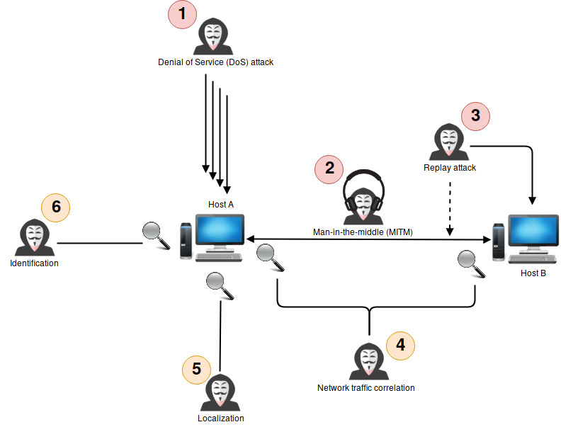
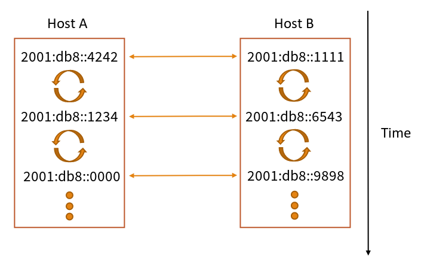
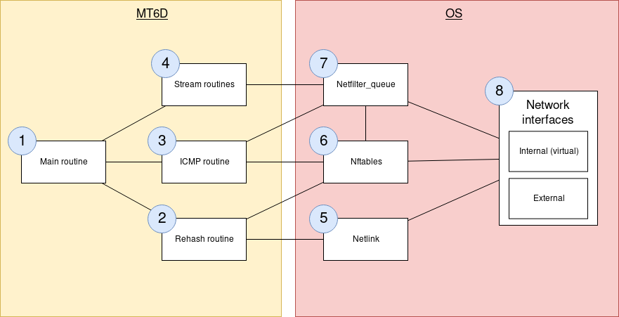

# A Moving Target IPv6 Defense Technical Specification

Document written by Bastien Dhiver on November 2018.

## Abstract

The Moving Target IPv6 Defense (MT6D) allows two hosts to communicate with each other over the Internet while providing security against targeted network attacks.
The confidentiality and anonymity of the communicating parties are preserved.

MT6D was developed at [Virginia Tech](https://vt.edu/) University. See [References](#references)

## Background

Static IP addressing on the Internet exposes hosts configured as such to several security and privacy issues:

Targeted network attacks (in red) and privacy and anonymity risks (in orange).

1. Denial of Service attack: The service offered by host A may be made unavailable.
2. Man-in-the-middle attack: Network traffic between host A and B can be observed and modified.
3. Replay attack: An operation order from host A to host B can be replayed by a third party actor.
4. Network traffic correlation: Knowing that host A communicates with host B.
5. Localization: Host A is connected from a particular network.
6. Identification: This machine is the same machine as the last time.

This static configuration offers an unlimited time interval for an attacker to try to find a weakness in the targeted system.

## Goals

* Implement MT6D
* Implement encryption feature
* Implement in-band Dynamic Key Generation feature (symmetric key exchange)
* Usable (limit overhead, latency, packet loss)

## Non-Goals

* Implement Dynamic Subnet Obscuration (DSO)
* Initial in-band public key exchange
* Gateway Device

## Proposal

### MT6D

An end-to-end communication is established between the hosts.
The system dynamically hides the network addresses of the sender and the receiver by repeatedly rotating them.
This makes MT6D hosts much more difficult to locate on a subnet than static hosts.
It is conceptually like a Virtual Private Network (VPN) where both endpoints are changing their IP addresses on a regular basis.

A simplified representation of the MT6D operating principle:

It is transparent to applications and hosts.
Packets can optionally be encrypted to prevent traffic correlation.
A secret key is shared between the correspondents.
An equation is used to calculate the current address of a host as well as the address of the recipient.
Once the addresses are calculated, the network packets are encapsulated in an MT6D virtual private network before being sent.
A potential attacker will spend its resources trying to repeatedly reacquire the target node after addresses rotation.
The vast address space available in IPv6 makes this possible because a host can assign itself a new IPv6 address with a low probability of collision in its subnetwork.
This technology operates at the network layer level.

### [Protocol Specifications](protocol.md)

### Architecture

MT6D components representation:

1. The main MT6D routine reads the configuration and launches the next three routines.
2. The rehash routine computes and binds the obscured addresses.
3. The ICMP routine handles ICMPv6 traffic that is not processed by stream routines.
4. The stream routines handle all packets that are part of the MT6D tunnel.
5. Netlink is used to manipulate the network stack (E.g. set an IP address to an interface).
6. Nftables is used to set firewall rules (E.g. redirect specific traffic to Netfilter queues).
7. Netfilter queues are used to process packets in userspace.
8. Packets are read and sent to network interfaces

### Limits

* MT6D is designed to operate on an IPv6 network only.
* Point-to-Point communications only.
* Both endpoints are required to have MT6D operating in order to communicate securely.

## Measuring Impact

Compliance with the specification will be verified through the analysis of network traffic between two hosts.

### Security and Privacy

* Can we determine who is communicating with who?
* Can we determine how many hosts are using MT6D?
* How "random" and similar obscured IIDs are? (Hamming distance, entropy)
* Is any traffic correlation possible from a packet capture file?

### Performances

* Packet size overhead
* Added latency
* Packet loss

## Security, Privacy, Risks

* Initial symmetric key exchange can reveal the identities of the communicating hosts.
* MT6D is a network-layer defense, it does not prevent attacks that occur at layers lower than the network layer.
* Including an unsupported communications path in MT6D could result in an adversary learning a host's actual address.
* Gain access to a MT6D device compromises the keys for all hosts the target device communicates with.

## Open Questions and Remarks

* Is there a simpler or more efficient way to perform i-DKG?
* Efficiency can be improved by using encryption modes that allow parallelization.
* Traffic should be authenticated.
* How public key can be exchanged without privacy issues?
* Improve overall performance by writing a kernel module implementation.
* Find another way to obscure the subnet IID than DSO.
* Strengthening the MT6D network's defenses by analyzing the activity on relinquished addresses.
* Optimizations on network handling (zero copy, raw socket, PF\_Ring) and with addresses binding.

## [References](ressources.md)
